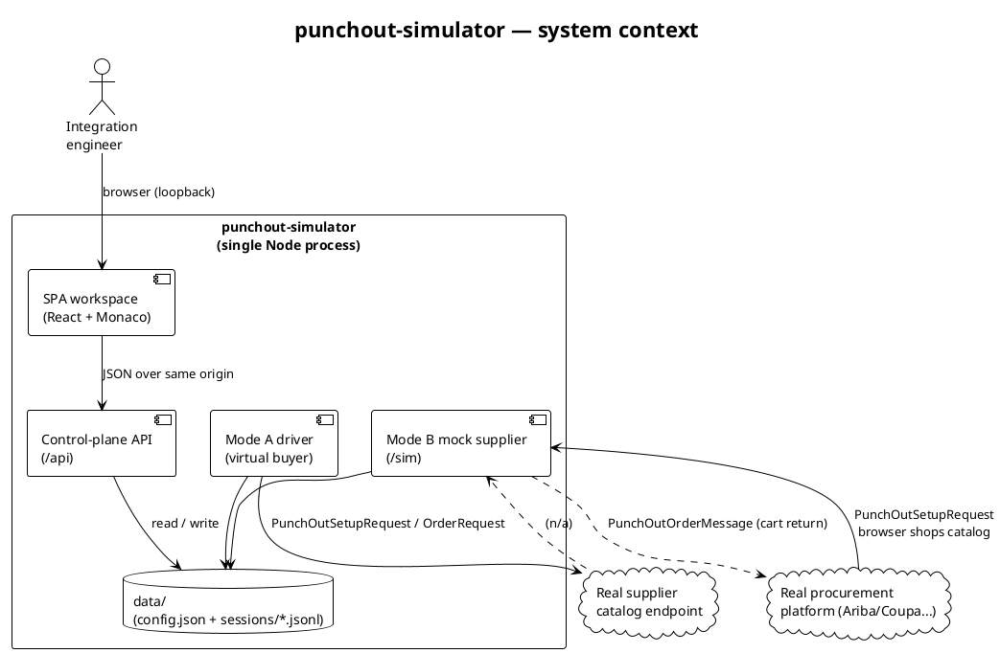
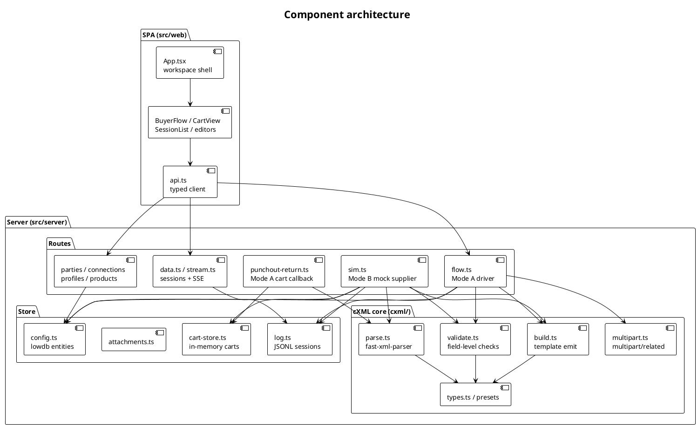
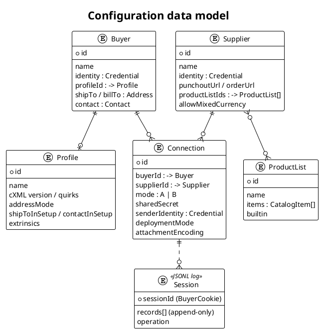
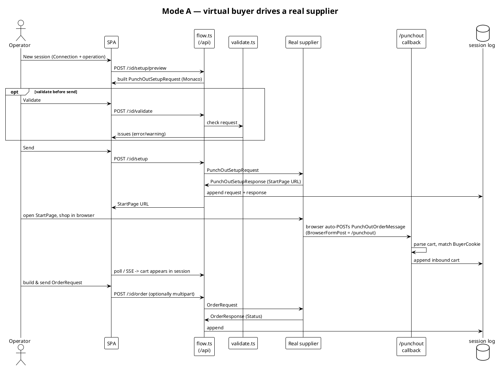
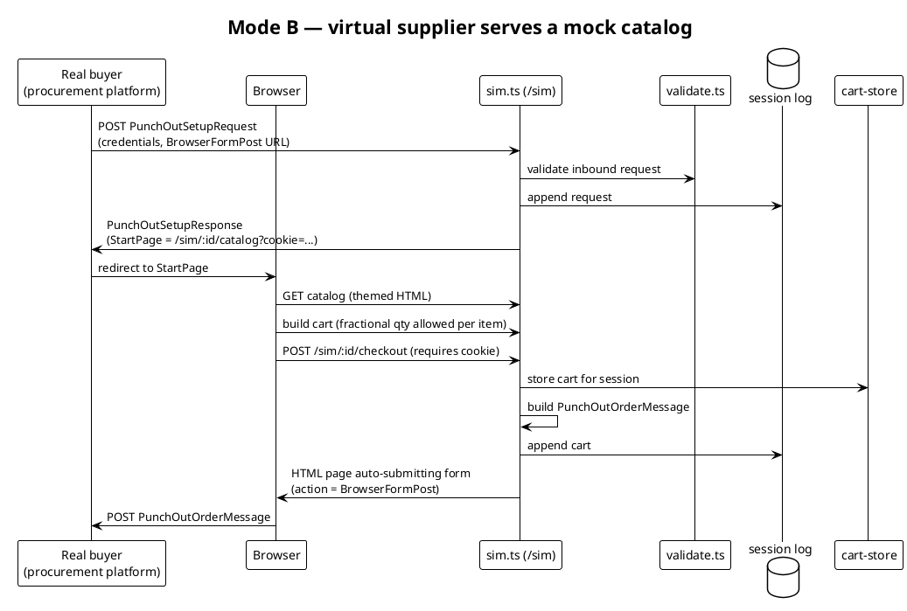
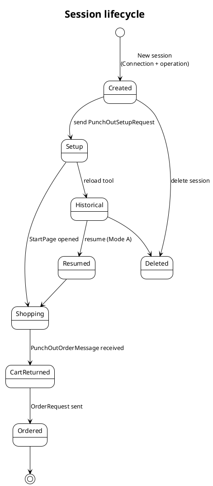

## Overview

**punchout-simulator** is a single-process developer tool for testing cXML
PunchOut integrations. It plays the part of a *virtual counterparty*: it can
behave as a **virtual buyer** that drives a real supplier's catalog
(**Mode A**), or as a **virtual supplier** that serves a mock catalog to a real
procurement platform (**Mode B**). Either way, the operator works against one
honest, inspectable end of a PunchOut conversation while the other end is the
real system under test.

The whole tool ships as one npm package. A Node process (Hono HTTP server)
serves both a JSON control-plane API and a built single-page application from
the same origin; the SPA is a React + Vite + Monaco workspace for composing,
sending, and inspecting cXML documents.

> [!NOTE]
> This document describes the *technical* architecture. For the business
> context — what PunchOut is and where this tool sits in a procurement
> workflow — see the **PunchOut business primer**. For day-to-day usage
> (sessions, operations, profiles, product lists), see the **Operations &
> usage guide**.

### Design constraints

The architecture is shaped by a few deliberate constraints:

- **cXML-only.** The tool speaks cXML PunchOut end to end. OCI and other
  protocols are out of scope (they are discussed in the business primer for
  contrast only).
- **Single process, local-first.** One `node` process, one `data/` directory.
  No external database, no message broker, no container orchestration. It runs
  on a developer laptop with `npx punchout-simulator`.
- **Loopback by default, token when exposed.** The control plane binds to
  loopback. The moment it is exposed on a non-loopback address, `/api` is gated
  behind a token. The inbound buyer-facing surface (`/sim`, `/punchout`) stays
  open so a real buyer system can reach it.
- **Append-only, inspectable history.** Every message in a conversation is
  appended to a per-session JSONL log. Nothing is destructive except an explicit
  session delete.

## System context

At runtime the simulator is one server that faces two directions. Toward the
operator it serves the SPA and the control-plane API. Toward the network it
either calls out to a real supplier (Mode A) or receives calls from a real
buyer (Mode B).

*Fig. 1: The simulator faces the operator (SPA + API) and the network (Mode A calls out to a real supplier; Mode B is called in by a real buyer).*

## Component architecture

Internally the server is a set of Hono route modules over a small cXML core and
a file-backed store. The SPA is a flat React app talking to those routes through
a single typed `api` client.

*Fig. 2: Route modules sit over a shared cXML core (build / parse / validate / multipart) and a file-backed store.*

### The cXML core

The `cxml/` package is protocol logic with no HTTP or storage knowledge:

| Module | Responsibility |
|---|---|
| `build.ts` | Emits cXML documents from typed inputs using template literals. Handles `PunchOutSetupRequest`, `OrderRequest`, address/contact blocks, classification blocks, and line-item totals (returns `0` for mixed-currency carts). |
| `parse.ts` | Parses inbound cXML with `fast-xml-parser`. XXE is rejected. |
| `validate.ts` | Bidirectional, field-level validation against expectations: credentials (only on header-bearing docs), single-currency, address completeness, operation/items coherence. Produces typed issues (error / warning). |
| `multipart.ts` | Hand-assembles and parses `multipart/related` for `OrderRequest` attachments. |
| `types.ts` + `*-presets.ts` | The shared domain types and the built-in profile / product-list presets. |

### The store

State lives in a single `data/` directory:

- **`config.json`** — a normalized lowdb document holding the entity tables
  (`buyers`, `suppliers`, `connections`, `profiles`, `productLists`). Migrations
  run at boot (inline-catalog → product list, `unspsc` → classifications,
  profile address-mode backfill).
- **`data/sessions/<sessionId>.jsonl`** — append-only message logs, one file per
  PunchOut conversation (keyed by `BuyerCookie`). Each line is one record
  (request or response, direction-tagged).
- **Attachments** — stored as separate content-addressed files, referenced from
  records rather than inlined.
- **Carts** — held in an in-memory `cart-store` keyed by `sessionId`; the
  durable record of a returned cart is the JSONL log.

## Data model

The configuration is normalized into independent entities so the same party or
product set can be reused across many integrations. A **Connection** is the unit
under test: it binds one Buyer to one Supplier, fixes which side the tool
simulates (`mode`), and carries the pair-specific credentials and deployment
options.

*Fig. 3: Buyer, Supplier, Connection, Profile and ProductList are normalized config entities; Sessions are append-only JSONL logs anchored to a Connection.*

> [!TIP]
> Endpoints (`punchoutUrl`, `orderUrl`) are *intrinsic to the Supplier* — they
> are the same for every buyer that talks to it, so they live on the Supplier,
> never per-Connection. Pair-specific data (credentials, deployment mode) lives
> on the Connection.

## Message flows

### Mode A — virtual buyer drives a real supplier

In Mode A the operator composes and sends the buyer-side documents; the real
supplier responds. The cart comes back through the browser to the tool's own
`/punchout` callback, which parses it and files it under the session.

*Fig. 4: Mode A — the tool sends buyer documents, the real supplier responds, and the cart returns through the `/punchout` callback.*

### Mode B — virtual supplier serves a mock catalog

In Mode B a real procurement platform calls the tool. The tool answers the
`PunchOutSetupRequest` with a StartPage, serves a themed HTML catalog at
`/sim/:supplierId/*`, and when the operator checks out it builds the
`PunchOutOrderMessage` and auto-POSTs it back to the buyer's `BrowserFormPost`
URL. The mock supplier also **honours the setup `operation`**: for `edit` it
re-reads the carried `ItemOut` from the session log and pre-fills the catalog
quantities (items it doesn't list show as extra rows); for `inspect` it renders
the carried item(s) read-only and returns them unchanged.

*Fig. 5: Mode B — the tool answers the buyer's setup, serves a catalog, and posts the cart back through the browser to the buyer's form-post URL.*

> [!IMPORTANT]
> `/sim/:id/checkout` **requires a `BuyerCookie`**. A cookie-less checkout is
> rejected with `400` and creates no session. This guards against a phantom
> session being minted on every stray request — the catalog must be opened from
> a real `PunchOutSetupResponse` StartPage for a checkout to count.

## Sessions

A **session** is one PunchOut conversation, identified by its `BuyerCookie`
(used verbatim as the `sessionId`). It is the primary unit the operator works
with: every request and response in the conversation is appended to that
session's JSONL log, and the SPA renders a per-session message log rather than a
global firehose.

*Fig. 6: A session moves from setup through shopping and cart return to order; historical Mode A sessions can be resumed, and any session can be deleted.*

The `operation` attribute (`create` / `edit` / `inspect`) is captured from the
`PunchOutSetupRequest` and shown on the session row. It drives what the outbound
document carries — see the Operations & usage guide for the business meaning of
each.

## Security posture

The tool is built to be safe to run locally and to expose deliberately:

- **Exposure gating.** `/api/*` (except `/api/health`) requires the token
  whenever one is configured — which happens automatically on a non-loopback
  `--public-url` or `--host`. The token is accepted as a Bearer header,
  `x-pos-token` header, `?token=` query, or `pos-api-token` cookie.
- **Inbound surface stays open.** `/sim` and `/punchout` are not token-gated, so
  a real buyer system can reach the Mode-B supplier and the Mode-A callback.
- **Secrets are write-only.** Shared secrets are accepted on write and redacted
  from every log and API read-back.
- **Body-size limit.** Requests are capped (24 MB, generous for attachments) so
  an oversized unauthenticated POST cannot exhaust memory.
- **XXE rejection** in the parser, **SSE connection cap** on the live log, and
  **path sanitization** in the session-file resolver (with a containment
  assertion on delete).

## Build and distribution

| Aspect | Detail |
|---|---|
| Language | TypeScript, ESM, single package |
| Server | Hono on `@hono/node-server` |
| SPA | React + Vite + Monaco editor |
| Dev | `npm run dev` — Vite (`:5173`) + `tsx watch` server concurrently |
| Build | `vite build` (SPA) + `tsc` (server) into `dist/` |
| Publish | Only `dist/` is published; `bin` → `dist/server/cli.js` |
| Run | `npx punchout-simulator` (loopback, opens browser, seeds demo data) |

CI publishes with `npm publish --provenance` (SLSA) on GitHub Release.
