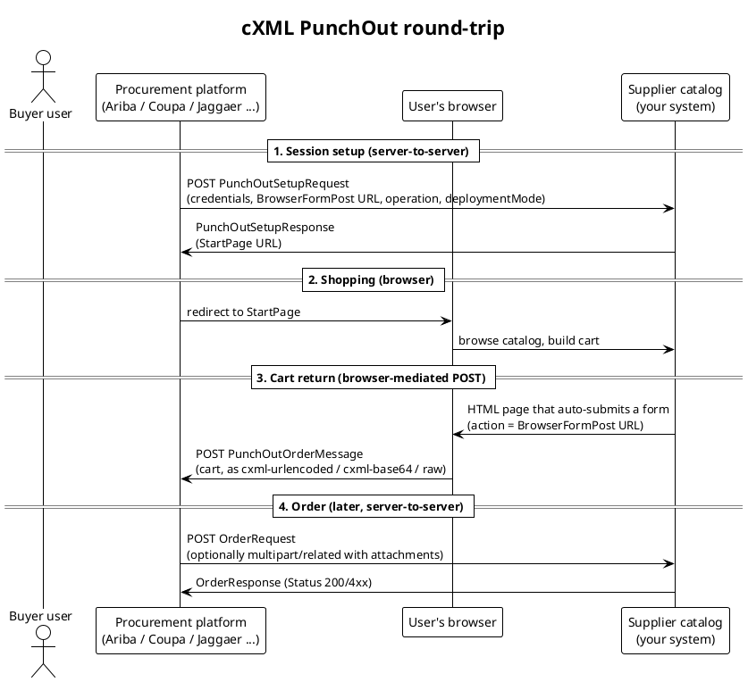
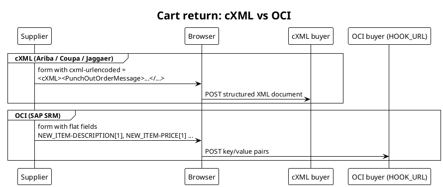

## Executive summary

A supplier exposing a PunchOut catalog rarely talks to "one" standard. While the
dominant protocol — **cXML**, created by Ariba in 1999 — is shared by SAP Ariba,
Coupa, Jaggaer, Oracle Procurement and Workday, the requests that actually arrive
at a supplier endpoint differ in meaningful, testable ways:

- **Protocol family.** Most modern platforms speak **cXML**, but a sizeable
  installed base (notably SAP SRM) speaks **OCI (Open Catalog Interface)**, a
  fundamentally different, form-parameter-based protocol. A few systems support
  both.
- **cXML version.** cXML is a *family* of DTD-versioned dialects (1.1 and the
  long-lived 1.2.x line, current **1.2.069**). Platforms pin **different DTD
  versions per document type** — there is no single "the cXML version".
- **Request mechanics.** Even within cXML, platforms vary in credential/auth
  style, the `deploymentMode` flag, the `operation` attribute, how the cart is
  posted back (`cxml-urlencoded` vs `cxml-base64` vs raw), how `OrderRequest`
  attachments are MIME-encoded, and which extrinsic fields they attach.

> [!IMPORTANT]
> The practical takeaway for a supplier: "supporting cXML PunchOut" is not a
> single checkbox. Robust suppliers parse **leniently** (accept a range of DTD
> versions and transport encodings) and emit **strictly** (target the buyer's
> expected version). The variation surface below is exactly what a simulator like
> this project is built to exercise.

## The PunchOut round-trip (shared shape)

Every cXML PunchOut integration follows the same three-leg shape, regardless of
platform. Understanding it is the key to seeing *where* platforms diverge.


*Fig. 1: The cXML PunchOut round-trip. Legs 1 and 4 are server-to-server; the cart return (leg 3) is a form POST from the user's own browser — which is why a buyer's localhost callback works even against a remote supplier.*

The protocol is deliberately split between **server-to-server** legs (setup, order)
and a **browser-mediated** leg (the cart return). Platforms differ within each leg
but never change this skeleton.

## The protocol landscape: cXML is not alone

Before comparing cXML versions, it is worth placing cXML against the other
PunchOut protocols a supplier may encounter.

| Protocol | Origin | Transport shape | Typical platforms | Notes |
|---|---|---|---|---|
| **cXML** | Ariba (1999) | Structured XML documents over HTTP | Ariba, Coupa, Jaggaer, Oracle Procurement, Workday, Proactis | The de-facto standard; richest data model. |
| **OCI** (Open Catalog Interface) | SAP | URL/HTML form parameters (`HOOK_URL`, `NEW_ITEM-*`) | SAP SRM, SAP-based systems | Simpler, faster to implement, less flexible; no native order/invoice flow. |
| **OAG / xCBL / EDI variants** | Various | XML or EDI | Legacy / niche | Rare in new integrations; sometimes bridged. |

> [!NOTE]
> The biggest *structural* divergence a supplier faces is **cXML vs OCI**, not
> one cXML platform vs another. OCI carries the cart back as flat form fields
> (`NEW_ITEM-DESCRIPTION[1]`, `NEW_ITEM-PRICE[1]`, …) to a `HOOK_URL`, with no
> `PunchOutOrderMessage` XML at all. If you must serve SAP SRM directly, you are
> implementing a second protocol, not a variant of the first.


*Fig. 2: cXML returns a single structured XML payload; OCI returns a flat list of indexed form fields. Same browser-POST mechanism, completely different payload model.*

## cXML versions: a family, not a number

cXML is defined by **DTDs** (Document Type Definitions). Every cXML document
declares the DTD it targets in its header, e.g.:

```xml
<!DOCTYPE cXML SYSTEM "http://xml.cxml.org/schemas/cXML/1.2.014/cXML.dtd">
```

There are two living lines — **1.1** and **1.2.x** — and the 1.2 line has
accreted dozens of point releases (…1.2.014, 1.2.020, 1.2.038…, current
**1.2.069**, updated February 2026). New point releases mostly **add** document
types and optional elements rather than break existing ones:

- **1.2.001** introduced `Fulfill.dtd` (Confirmation / Ship Notice).
- **1.2.006** introduced `InvoiceDetail.dtd` (Invoice Detail Request).
- **1.2.008** introduced `Catalog.dtd`.

### Different versions per platform — and per document

The crucial point for suppliers: a platform does **not** adopt "a cXML version"
wholesale. It supports specific DTD versions **per document type**. Coupa, for
example, publishes exactly this matrix:

| Document type | Coupa-supported DTD version |
|---|---|
| PunchOut Setup Request (POSR) | 1.2.014 |
| StoreFront PunchOut Order Message (POOM) | 1.2.023 |
| Purchase Order (no Supply Chain Collaboration) | 1.2.014 |
| Purchase Order (with Supply Chain Collaboration) | 1.2.056 |
| Advance Ship Notice (ASN) | 1.2.014 |
| Invoice | 1.2.020 |
| Order Confirmation | 1.2.036 |

*Source: Coupa "Supported cXML DTD Version Per Document Type".*

Ariba, Jaggaer, Oracle and others each have their own such expectations. Because
the 1.2.x line is broadly backward-compatible, a document that declares an older
DTD (e.g. 1.2.014) is normally still accepted by a system that understands a
newer one — but the **reverse is not guaranteed**: emitting a brand-new element
against a buyer pinned to an old DTD can trip strict validators.

> [!TIP]
> Practical rule of thumb: **parse liberally, emit conservatively.** When you act
> as the buyer (sending `PunchOutSetupRequest` / `OrderRequest`), target a widely
> supported DTD such as **1.2.0xx in the low range** unless a partner specifies
> otherwise. When you act as the supplier (receiving), do not hard-fail on an
> unexpected DTD version string — validate fields, not the version literal.

## Where the requests actually differ (the variation surface)

Within cXML, these are the concrete dimensions along which the requests a
supplier receives vary by platform. This is the checklist worth testing.

### 1. DTD version pinning and validator strictness

As above: which `cXML.dtd` version is referenced, and whether the receiver does
full DTD validation or lenient field checks. Some suppliers reject unknown
versions outright; mature ones do not.

### 2. Credentials and authentication style

- **`SharedSecret`** in the `Sender/Credential` is the most common scheme: a
  per-relationship password.
- **`CredentialMac`** (a time-boxed MAC/HMAC token) is used by some platforms and
  network-routed flows instead of a static secret.
- **Identity domains** vary widely (`DUNS`, `NetworkID`, `AribaNetworkUserId`,
  custom buyer domains), and **test credentials are often suffixed** (e.g.
  `acme-T` for test vs `acme` for production).

### 3. `deploymentMode`: test vs production

The `Request/@deploymentMode` attribute is `test` or `production` (default
`production`). Buyers frequently run a test cycle first, with different
credentials and endpoints. A supplier must route/validate both.

### 4. `operation`: create / edit / inspect

`PunchOutSetupRequest/@operation` tells the supplier why the session is opening:

- **`create`** — a fresh shopping session (land on the catalog home).
- **`edit`** — the user is re-opening an existing cart (the request carries the
  prior `PunchOutOrderMessage` items; the supplier should restore that cart).
- **`inspect`** — read-only view of a previously returned line.

Not every platform exercises `edit`/`inspect` equally; supporting them is a
common gap in supplier catalogs.

### 5. Cart-return transport encoding

The browser posts the `PunchOutOrderMessage` back as an HTML form field, and the
field name / encoding differs:

| Style | Field | Used by |
|---|---|---|
| URL-encoded XML | `cxml-urlencoded` | Ariba and many others (most common) |
| Base64 XML | `cxml-base64` | SAP Business Network / some Ariba flows |
| Raw body | (posted as the request body) | Some custom buyers |

A supplier's return handler should accept **all three**.

### 6. OrderRequest attachment (MIME) encoding

When a later `OrderRequest` carries attachments, it becomes a
`multipart/related` envelope. The per-part **`Content-Transfer-Encoding`** varies:

- **`binary`** — raw bytes; valid over HTTP (8-bit clean) and more compact.
- **`base64`** — what many Ariba/Coupa receivers expect, especially for binary
  files; Coupa explicitly documents adding attachments in "Base64 multipart"
  form.

Receivers also differ in how strictly they enforce the `cid:` reference between
`<Attachment><URL>cid:…</URL>` and the matching part `Content-ID`.

> [!WARNING]
> A part encoded `Content-Transfer-Encoding: binary` is legal over HTTP, but some
> production receivers only reliably handle **base64**. If a partner rejects your
> attachments "for no reason", the transfer encoding is the first thing to flip.

### 7. Direct order vs network-routed order

How leg 4 reaches the supplier varies:

- **Direct**: the buyer posts `OrderRequest` straight to the supplier's order URL
  (common with Coupa, Jaggaer, self-hosted).
- **Network-routed**: the order flows through a B2B network (e.g. SAP Business
  Network / Ariba Network), which may re-wrap credentials, add routing headers,
  and impose its own DTD/transport expectations.

### 8. Extrinsics and custom fields

Platforms attach `<Extrinsic name="…">` elements for cost centers, user email,
buyer cookies, UNSPSC hints, tax/compliance data, etc. The **set and naming of
extrinsics is the least standardized part of cXML** — every buyer adds its own,
and suppliers must ignore unknown ones gracefully.

## Per-platform snapshot

A high-level comparison of the major platforms a supplier integrates with.

| Platform | Primary protocol | Also supports | Notable request characteristics |
|---|---|---|---|
| **SAP Ariba** | cXML | Network-routed via Ariba/SAP Business Network | `SharedSecret` or network creds; `cxml-urlencoded` and `cxml-base64`; strong test/production separation; rich extrinsics. |
| **Coupa** | cXML (direct) | — | Pins specific DTD versions per document type (table above); direct order posting; pragmatic, lenient parsing. |
| **Jaggaer** | cXML | — | cXML setup/return/order; supplier-network onboarding; standard `SharedSecret`. |
| **Oracle Procurement / iProcurement** | cXML | Legacy "XML"/transparent punchout | Both modern cXML and older Oracle punchout styles depending on EBS/Fusion version. |
| **SAP SRM** | **OCI** | — | Form-parameter `HOOK_URL` return; `NEW_ITEM-*` fields; **not** cXML — a separate implementation. |
| **Workday** | cXML | — | Cloud-native; standard cXML with its own credential/extrinsic conventions. |

## Implications for a supplier — and how to test them

For a supplier-side developer, the variation above maps directly to a test
matrix. Each row is a real-world failure mode worth reproducing **before** a
buyer's go-live, not during it.

- Accept **all three** cart-return transports (`cxml-urlencoded`,
  `cxml-base64`, raw).
- Validate **fields**, not the **DTD version string**; accept a range of 1.2.x.
- Handle `operation` = `create`, `edit`, and `inspect`.
- Accept `OrderRequest` attachments in **both** `binary` and `base64`
  `Content-Transfer-Encoding`, and enforce `cid:` resolution.
- Exercise `deploymentMode = test` and `production` paths and credential suffixes.
- Ignore unknown `Extrinsic` elements without failing.

> [!TIP]
> This is precisely the role of **punchout-simulator** in virtual-buyer mode: it
> lets a supplier-side developer drive their catalog with controllable
> `PunchOutSetupRequest` / `OrderRequest` documents — toggling deployment mode,
> attachment transfer encoding (binary/base64), and deliberately dangling
> `cid:` references — to reproduce these platform differences without needing a
> live Ariba/Coupa/Jaggaer tenant.

## Conclusion

There is no single "cXML standard request" a supplier receives. cXML is a
versioned family (1.1 and a deep 1.2.x line, current 1.2.069), platforms pin
**different DTD versions per document type**, and even on the same version they
diverge in authentication, deployment mode, the `operation` verb, cart-return
transport, attachment MIME encoding, routing, and extrinsics — while a portion of
the market (SAP SRM) is not cXML at all but **OCI**. The durable engineering
posture for a supplier is to **parse liberally and emit conservatively**, and to
verify each axis of variation against a simulator rather than discovering it in a
buyer's production cutover.

## Sources

- [cXML: Commerce XML — Release Notes](https://cxml.org/release-notes.html)
- [cXML Reference Guide (current, 1.2.07x)](https://xml.cxml.org/current/cXMLReferenceGuide.pdf)
- [cXML — Wikipedia](https://en.wikipedia.org/wiki/CXML)
- [Coupa — Supported cXML DTD Version Per Document Type](https://compass.coupa.com/en-us/products/product-documentation/supplier-resources/for-suppliers/coupa-supplier-portal/set-up-the-csp/purchase-orders/purchase-order-collaboration-with-buyers/supported-cxml-dtd-version-per-document-type)
- [SAP Ariba PunchOut Integration — supplier guide](https://punchout-gateway.com/sap-ariba-punchout-integration-how-it-works-and-what-suppliers-need-to-know/)
- [Coupa PunchOut Integration — supplier guide](https://punchout-gateway.com/coupa-punchout-integration-how-it-works-and-supplier/)
- [Jaggaer PunchOut Integration — supplier guide](https://punchout-gateway.com/jaggaer-punchout-integration-how-it-works-and-supplier-requirements/)
- [OCI vs cXML — differences and use cases](https://punchout-gateway.com/oci-vs-cxml-differences-use-cases-and-punchout-integration-explained/)
- [What is OCI PunchOut? (TradeCentric)](https://tradecentric.com/blog/sap-srm-oci-punchout/)
- [Open Catalog Interface — Wikipedia](https://en.wikipedia.org/wiki/Open_Catalog_Interface)
- [Oracle iProcurement and Oracle Exchange Punchout Guide](https://docs.oracle.com/cd/A99488_03/acrobat/icx115punchout.pdf)
- [SAP — Learning About cXML and PunchOut](https://help.sap.com/docs/business-network-for-procurement/cxml-solutions/learning-about-cxml-and-punchout)
- [Coupa — Add an Encoded (Base64) Attachment to a cXML Invoice](https://compass.coupa.com/en-us/products/product-documentation/supplier-resources/for-suppliers/integration-resources/compliant-invoicing/add-an-encoded-attachment-to-a-cxml-invoice)
