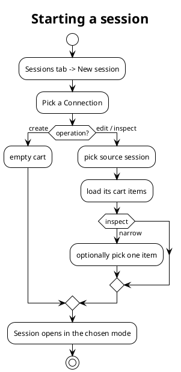

## Getting started

Run the tool with no installation:

```bash
npx punchout-simulator
```

It binds to loopback, seeds a demo Buyer, Supplier, Connection and a sample
product list on first run, and opens the browser. Useful flags:

| Flag | Purpose |
|---|---|
| `--port`, `-p` | HTTP port (default `8080`). |
| `--data-dir`, `-d` | Where `config.json` and `sessions/` live (default `./data`). |
| `--public-url` | Expose on a non-loopback URL; this **enables token auth** on `/api`. |
| `--host` | Bind host (also enables token auth when non-loopback). |
| `--token` | Set the API token explicitly (otherwise generated when exposed). |
| `--no-open` | Don't open the browser. |
| `--no-seed` | Don't seed demo data. |

> [!NOTE]
> When you expose the tool (`--public-url` or a non-loopback `--host`), `/api` is
> gated behind a token, but `/sim` and `/punchout` stay open so a real buyer
> system can reach the Mode-B catalog and the Mode-A callback.

## The workspace

The SPA is split into two areas in the left navigation:

- **Run** — the **Sessions** tab, where you do PunchOut work.
- **Configure** — **Connections**, **Buyers**, **Suppliers**, **Products**, and
  **Buyer Profiles**, where you set up the entities a session uses.

Configure the entities once; spend your time in **Sessions**.

## Configuring entities

### Buyers and Suppliers

A **Buyer** is the procurement-platform side: a credential identity, an optional
**Buyer profile**, and optional default **ship-to / bill-to addresses** and an
**end-user contact**. A **Supplier** is the catalog side: a credential identity,
its `punchoutUrl` / `orderUrl` endpoints, the **product lists** it serves in
Mode B, and an `allowMixedCurrency` flag.

> [!TIP]
> Endpoints belong to the Supplier, not the Connection — they are the same for
> every buyer that talks to that supplier. Pair-specific data (shared secret,
> deployment mode) lives on the Connection.

### Connections

A **Connection** binds one Buyer to one Supplier and is the thing a session runs
against. It fixes:

- **Mode** — `A` (virtual buyer drives the real supplier) or `B` (virtual
  supplier serves a mock catalog to the real buyer).
- **Shared secret** and optional **sender identity** override.
- **Deployment mode** and **attachment encoding** (`binary` or `base64`) for
  `OrderRequest` attachments.

### Buyer profiles

A **Buyer profile** captures procurement-platform quirks so a buyer emits
platform-shaped documents: cXML version, **address mode** (`id-only` / `full` /
`both`), whether ship-to and contact appear in the setup request
(`shipToInSetup` / `contactInSetup`), and extrinsics. Built-in presets exist for
Ariba, Coupa, SAP and a generic default; you can clone and customize them.

### Product lists

A **product list** is a reusable, named set of catalog items served by Mode-B
suppliers. The served catalog is the union of a supplier's assigned lists.
Items carry rich fields:

- `description`, `supplierPartId`, optional `supplierPartAuxiliaryId`
- one or more **classifications** (`domain` + `value`, e.g. UNSPSC)
- `uom`, `unitPriceAmount`, `currency`
- `allowFractional` — when set, the catalog accepts fractional quantities (e.g.
  `1.5`); otherwise quantities are floored to whole numbers.

You can load the built-in sample assortment as a preset, or import items from
CSV (header aliases, decimal-comma tolerant). A list that is referenced by a
supplier cannot be deleted (the API returns `409`).

## Running a session

A **session** is one PunchOut conversation. Start one from the **Sessions** tab
with **New session**, which asks for:

1. a **Connection** (which fixes the mode), and
2. an **operation** — `create`, `edit`, or `inspect`.

For `edit` and `inspect` you also pick a **source session** to take prior cart
items from (and `inspect` can be narrowed to a single item).



*Fig. 1: The New-session dialog picks a connection, an operation, and (for edit/inspect) a source cart.*

Each session has its **own message log** — every request and response in that
conversation, viewable as raw cXML. This replaced the old global firehose, so
parallel sessions no longer interleave.

### Mode A walk-through (virtual buyer)

1. **New session** on a Mode-A connection, operation `create`.
2. The setup request is built and shown in Monaco. Click **Validate** to check
   it before sending.
3. **Send** the `PunchOutSetupRequest`. The real supplier returns a
   `PunchOutSetupResponse` with a **StartPage** link.
4. **Open the StartPage** and shop on the real supplier's site. On checkout the
   supplier posts the cart back to the tool's `/punchout` callback; it appears in
   the session as a `PunchOutOrderMessage`.
5. Build and **Send the OrderRequest** (optionally with attachments). The
   supplier replies with an `OrderResponse`.

### Mode B walk-through (virtual supplier)

1. Configure a Mode-B connection and assign the supplier one or more product
   lists.
2. Point the **real procurement platform** at the tool's supplier endpoint
   (`/sim/:supplierId/...`).
3. The platform sends a `PunchOutSetupRequest`; the tool replies with a StartPage
   that opens the **themed mock catalog**.
4. The user shops and checks out; the tool builds a `PunchOutOrderMessage` and
   auto-POSTs it to the platform's `BrowserFormPost` URL.

> [!IMPORTANT]
> A checkout against `/sim/:id/checkout` **requires a `BuyerCookie`**. Always
> reach the catalog by opening the StartPage from a real
> `PunchOutSetupResponse` — a cookie-less checkout is rejected (`400`) and is
> never logged as a session.

## Operations explained

The operation you choose sets the `operation` attribute on the outbound
`PunchOutSetupRequest` and what it carries:

| Operation | Outbound document | When to use |
|---|---|---|
| **create** | Empty `PunchOutSetupRequest`, no `ItemOut`. | A fresh shopping trip. |
| **edit** | `operation="edit"` + the source cart's items as `ItemOut`. | Revise items already chosen from this supplier. |
| **inspect** | `operation="inspect"` + the item(s) to view as `ItemOut`. | Re-check a previously selected item's spec/price. |

### What "edit" actually does — both ends

`edit` is, first, about the **outbound** document. The buyer-side
`PunchOutSetupRequest` you send declares `operation="edit"` and includes the
prior cart items as `ItemOut` blocks. A *real* supplier honours this by
pre-loading its cart to that state so the user can adjust it.

The **Mode-B mock supplier now honours it too.** When it receives an
`operation="edit"` request, it reads the carried `ItemOut` items (from the
session's setup request) and pre-loads the catalog:

- Items the buyer already had that exist in the supplier's catalog show with
  their **quantities pre-filled** — change them and return the revised cart.
- Items the buyer had that the catalog doesn't list appear as **extra "from
  cart" rows** so the edit round-trips faithfully.

For **`inspect`**, the mock supplier shows the carried item(s) **read-only** and
returns them unchanged on checkout — matching the "view this item" intent.

> [!NOTE]
> The pre-load is derived from the latest inbound `PunchOutSetupRequest` in the
> session log, so the catalog and the checkout always agree without extra state.
> Catalog matching is by `SupplierPartID` (plus `SupplierPartAuxiliaryID` when
> present); items the supplier doesn't carry pricing for keep the values the
> buyer sent.

## Validation

Every outbound document can be validated **before sending** with the
**Validate** button next to **Send**. Validation is bidirectional and
field-level; it surfaces typed **errors** and **warnings**:

| Check | Behaviour |
|---|---|
| Credentials | Verified only on header-bearing documents (SetupRequest / OrderRequest / PunchOutOrderMessage) — responses are exempt. |
| Single currency | Mixed currencies in one cart are an **error** (and the total emits `0`), unless the supplier's `allowMixedCurrency` is set, which downgrades it to a **warning**. |
| Address completeness | Incomplete ship-to / bill-to (per the buyer profile's address mode) is flagged. |
| Operation / items coherence | `edit`/`inspect` with no items, or `create` with unexpected items, is flagged. |

> [!TIP]
> Validate is advisory — you can still send. Use it to catch obvious mismatches
> before involving the real system, so a failure is unambiguous.

## Addresses and contact

A buyer carries optional default **ship-to**, **bill-to**, and an **end-user
contact**. The address editor enforces real-world structure:

- **Country first** — chosen from the ISO 3166-1 list, which sets both the ISO
  code and the country name.
- **State / province** — a dropdown for US/CA, free text elsewhere.
- **Postal code** — format-validated per country where a pattern is known.

How addresses appear on the wire is **profile-driven** via the address mode
(`id-only`, `full`, or `both`) and the `shipToInSetup` / `contactInSetup` flags.
Order requests default to the buyer's addresses.

## Attachments

`OrderRequest` can carry attachments. The tool assembles a `multipart/related`
body by hand; the **attachment encoding** (`binary` or `base64`) is set per
Connection. Many real Ariba/Coupa receivers expect `base64`; `binary` is more
compact and valid over HTTP. Attachments are stored content-addressed and
referenced from the session log rather than inlined.

## Managing sessions

- **Per-session log** — select a session to see only its messages.
- **Resume** — a historical Mode-A session can be resumed; the tool reconstructs
  the flow state (StartPage, last status) from the session's records.
- **Delete** — remove a session and its log. Deletion is path-guarded so only
  files inside the sessions directory can be removed.

> [!NOTE]
> If a flood of empty sessions ever appears, the cause is almost always
> cookie-less `/sim/:id/checkout` calls. Current builds reject these with `400`
> and create no session; opening the catalog from a real StartPage is required.

## Data and storage

Everything lives under the data directory:

- `config.json` — the normalized entities (buyers, suppliers, connections,
  profiles, product lists). Migrations run automatically at boot.
- `sessions/<sessionId>.jsonl` — one append-only log per conversation.
- attachment blobs — content-addressed, referenced from records.

To start clean, stop the tool and delete the data directory (or point
`--data-dir` somewhere fresh). To archive a conversation, copy its `.jsonl` file.
