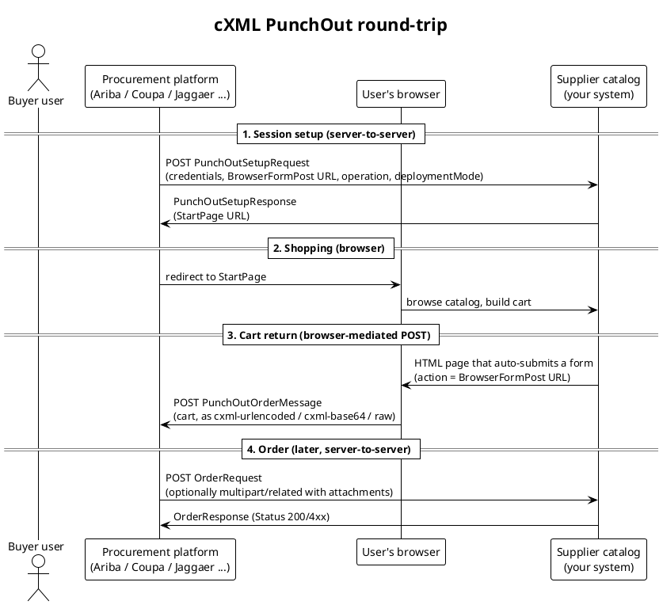
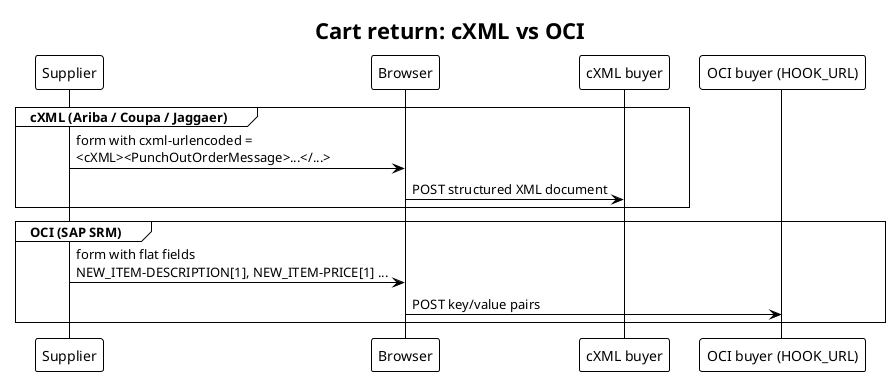
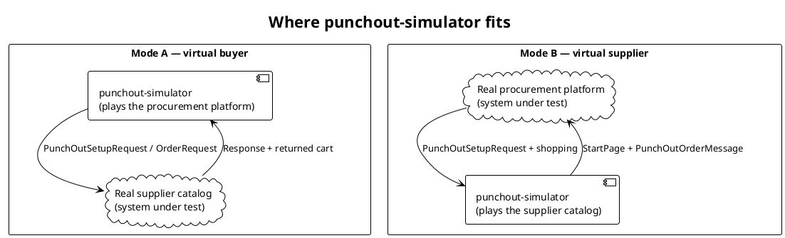

## What problem PunchOut solves

A large organization buys from many suppliers. It wants every purchase to flow
through one **procurement platform** (SAP Ariba, Coupa, Jaggaer, Oracle, Workday
…) so that spend is controlled, approvals are enforced, and orders are auditable.
But it does not want to maintain a copy of every supplier's catalog — prices,
availability, and configurable products change constantly and are best known by
the supplier.

**PunchOut** is the standard that resolves this tension. Instead of importing a
catalog, the buyer's procurement platform lets an approved user "punch out" to
the supplier's *own* live web catalog, shop there, and bring a finished cart
back into the procurement platform for approval and ordering. The supplier keeps
control of the catalog experience; the buyer keeps control of the process and
the money.

> [!NOTE]
> PunchOut is sometimes called "round-trip" or "catalog interchange". The
> dominant protocol is **cXML**, created by Ariba in 1999 and now spoken by most
> major procurement platforms. A separate older protocol, **OCI**, is covered
> briefly later for contrast.

## The actors

| Actor | Role in the process |
|---|---|
| **Buyer user (requisitioner)** | An employee who needs to buy something. Works entirely inside the procurement platform's UI. |
| **Procurement platform** | The buyer's system of record (Ariba, Coupa, …). Initiates PunchOut, enforces approvals, issues the purchase order. Also called the *buyer system*. |
| **Supplier catalog** | The supplier's web storefront, adapted to receive PunchOut sessions and return carts as structured documents. |
| **Approver / finance** | Downstream roles inside the procurement platform that approve the requisition and reconcile the invoice. |

In cXML terms the procurement platform is the **buyer** and the supplier's
catalog is the **supplier**. Every message carries credentials identifying both
parties and a shared secret proving the pair is authorized.

## The PunchOut round-trip

A complete PunchOut purchase is a *round-trip*: the user leaves the procurement
platform, shops on the supplier site, and returns with a cart — then, later, the
platform sends the actual order. There are four distinct exchanges, and they
alternate between **server-to-server** calls and **browser-mediated** posts.

*Fig. 1: The four exchanges of a cXML PunchOut round-trip.*

### Step by step

1. **Session setup.** When the user clicks "punch out to Supplier X", the
   procurement platform makes a *server-to-server* `PunchOutSetupRequest`. It
   carries the credentials, a shared secret, the `BrowserFormPost` URL where the
   cart should be returned, and flags like `operation` and `deploymentMode`. The
   supplier replies with a `PunchOutSetupResponse` containing a one-time
   **StartPage** URL.
2. **Shopping.** The user's browser is redirected to the StartPage and shops on
   the supplier's site like any web store — searching, configuring, adding to
   cart. The procurement platform is not involved during this step.
3. **Cart return.** When the user clicks "check out" or "transfer cart", the
   supplier does *not* place an order. Instead it returns the cart as a
   structured `PunchOutOrderMessage`, posted back through the browser to the
   `BrowserFormPost` URL the platform supplied in step 1.
4. **Order.** The cart lands in the procurement platform as a draft requisition.
   It goes through approval. Only then — possibly days later — does the platform
   send the real `OrderRequest` (the purchase order) server-to-server to the
   supplier, which acknowledges with an `OrderResponse`.

> [!IMPORTANT]
> The cart return is **not** an order. It is a proposal that re-enters the
> buyer's controlled process. The legally and financially meaningful document is
> the later `OrderRequest`. Confusing the two is the single most common
> conceptual mistake in PunchOut integration.

## Operations: create, edit, inspect

The `PunchOutSetupRequest` carries an `operation` attribute that tells the
supplier *why* the user is punching out:

| Operation | Business meaning |
|---|---|
| **create** | A fresh shopping trip. The user starts with an empty cart. |
| **edit** | The user already has items from this supplier in their requisition and wants to change them. The platform sends the existing line items so the supplier can **pre-load the cart**; the user adjusts and returns the revised cart. |
| **inspect** | The user wants to *view* a previously selected item on the supplier site (e.g. to re-check specs or price) without necessarily changing it. |

For `edit` and `inspect`, the procurement platform includes the existing line
items (as `ItemOut` blocks) inside the `PunchOutSetupRequest`. A
business-complete supplier honours those by restoring the cart to that state.

> [!TIP]
> In the simulator, the *outbound* document fully reflects the operation —
> `edit`/`inspect` carry `operation="edit"` and the prior cart items as
> `ItemOut`. The Mode-B mock supplier, however, currently ignores incoming
> `ItemOut`, so the demo exercises the buyer-side document rather than the
> supplier-side cart restoration. See the Operations & usage guide for how to
> drive this.

## cXML versus OCI

"Supporting PunchOut" is not a single target. The protocol family matters:

*Fig. 2: cXML returns a structured XML document; OCI returns flat form fields. They are different protocols, not versions of one.*

- **cXML** returns a structured XML document and is the dominant family (Ariba,
  Coupa, Jaggaer, Oracle, Workday).
- **OCI** (Open Catalog Interface, SAP SRM) returns flat `NEW_ITEM-*` form
  fields to a `HOOK_URL`. It is a fundamentally different protocol.

Even within cXML, platforms vary in credential style, the `deploymentMode` flag,
how the cart is posted back (`cxml-urlencoded` / `cxml-base64` / raw), how
`OrderRequest` attachments are MIME-encoded, and which extrinsic fields they
attach. A deeper treatment of these per-platform differences lives in the
companion analysis *"How Procurement Platforms Differ in PunchOut Requests"*.

> [!NOTE]
> **punchout-simulator speaks cXML only.** OCI is described here for context so
> that integrators understand why a given supplier or platform may not be a
> match for the tool.

## Where punchout-simulator fits

The hard part of PunchOut integration is that *both ends are live systems* and
each blames the other when something fails. The simulator gives you one honest,
fully inspectable end so you can isolate the real system under test.

*Fig. 3: Mode A tests a real supplier by simulating the buyer; Mode B tests a real procurement platform by simulating the supplier.*

### Two modes, two questions

- **Mode A — "is the *supplier* integration correct?"** The simulator acts as a
  virtual procurement platform. You compose and send the buyer-side documents to
  a real supplier endpoint and inspect exactly what comes back. Use this when you
  are a buyer onboarding a supplier, or a supplier validating your own catalog
  against a clean, standard buyer.
- **Mode B — "is the *buyer* integration correct?"** The simulator acts as a
  virtual supplier serving a mock catalog. A real procurement platform punches
  out to it, the user shops, and the cart is posted back. Use this when you are a
  supplier testing how a specific procurement platform talks to you, or a buyer
  validating your platform configuration against a clean, standard supplier.

### What the simulator gives you

- **A clean reference counterparty.** One end behaves to spec, so any deviation
  is attributable to the real system.
- **Full message visibility.** Every `PunchOutSetupRequest`,
  `PunchOutSetupResponse`, `PunchOutOrderMessage`, `OrderRequest` and
  `OrderResponse` is captured per session and viewable as raw cXML.
- **Validate-before-send.** Outbound documents can be checked against
  expectations (credentials, currency, address completeness, operation/item
  coherence) before they leave the tool.
- **Profiles and product lists.** Platform-specific quirks (cXML version,
  address mode, extrinsics) are captured as reusable buyer profiles; mock
  catalogs are reusable product lists shared across suppliers.

## A worked business scenario

A distributor is onboarding with a customer who runs Coupa. The two integration
questions can be tackled independently:

1. **Supplier proves its catalog (Mode A).** The distributor points the
   simulator's virtual buyer at its own catalog endpoint, using a Coupa-shaped
   profile. It punches out, shops, returns a cart, and sends an order — confirming
   its catalog produces a well-formed `PunchOutOrderMessage` and accepts an
   `OrderRequest`, *before* the customer's Coupa ever touches it.
2. **Buyer proves its platform (Mode B).** The customer points its Coupa instance
   at the simulator's virtual supplier. A buyer user punches out to the mock
   catalog, shops the sample assortment, and returns a cart into Coupa —
   confirming the platform's connection, credentials, and cart handling against a
   known-good supplier.

When both halves pass against the simulator, the only remaining variable is the
real-to-real handshake — and both sides already know their own end is correct.
