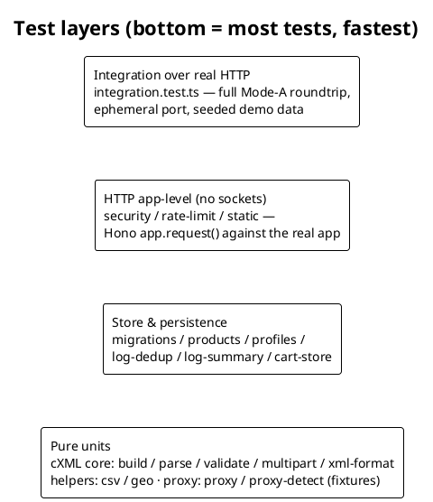

## Goals and philosophy

The simulator exists to make *other* systems' integration behaviour observable
and reproducible — so its own correctness has to be cheap to verify on every
change. The test suite is built around three principles:

- **Test the protocol logic as pure functions.** The cXML core (build / parse /
  validate / multipart) has no HTTP or storage knowledge, so most of the
  reasoning about correctness happens in fast, deterministic unit tests.
- **Make platform-specific code testable everywhere.** Anything that touches
  the OS (proxy detection, spawned commands, file reads) is written against
  injectable seams, with the parsing kept in pure functions exercised on
  captured real-world fixtures. The Windows registry parser is tested on Linux
  CI without a registry in sight.
- **One real end-to-end proof.** A full Mode-A roundtrip runs over real HTTP
  against the built-in mock supplier — the same wire path a user exercises —
  so wiring regressions can't hide between well-tested units.

There are no mocking frameworks and no test doubles beyond these seams: tests
call the real implementations on temporary data directories.

## The test pyramid

All tests live in `test/**/*.test.ts` and run under **Vitest** (`environment:
node`, 20-second timeout, one process-isolated environment per file). The suite
is currently 19 files across four layers:

*Fig. 1: Four layers — pure protocol units at the base, one real-HTTP integration proof at the top.*

### Layer 1 — pure units (cXML core and helpers)

| Suite | What it pins down |
|---|---|
| `build.test.ts` | Document emission: SetupRequest/OrderRequest shape, address and classification blocks, line-item totals (including the mixed-currency `0` total). |
| `parse.test.ts` | Inbound parsing with `fast-xml-parser`, including **XXE rejection**. |
| `validate.test.ts` | Field-level validation: credential checks only on header-bearing documents, single-currency rule and its `allowMixedCurrency` downgrade, address completeness per profile address mode, operation/items coherence. |
| `multipart.test.ts` | Hand-assembled `multipart/related` for attachments, both `binary` and `base64`. |
| `xml-format.test.ts` | The local prettifier used by the Copy/Prettify toolbar and the PDF export. |
| `csv.test.ts` / `geo.test.ts` | Product-list CSV import (header aliases, decimal-comma) and country/postal-code data. |

### Layer 2 — store and persistence

`migrations.test.ts` covers every boot migration (legacy flat connections →
normalized entities, inline catalog → product lists, `unspsc` →
classifications, address-mode backfill) against real `config.json` files in
temp directories. `products.test.ts` and `profiles.test.ts` cover entity CRUD
semantics (e.g. the `409` on deleting a referenced product list);
`log-dedup.test.ts`, `log-summary.test.ts` and `cart-store.test.ts` cover the
session-log and in-memory-cart behaviour.

### Layer 3 — HTTP app-level, no sockets

These suites call `app.request()` on the real Hono app — full middleware and
routing, no network:

- `security.test.ts` — the token gate of an exposed deployment: `401` without
  the token, all four accepted token carriers, the open `/api/health` probe and
  the deliberately open `/sim` + `/punchout` surfaces. It runs in **its own
  file** so the global runtime token cannot leak into other suites (Vitest
  isolates files).
- `rate-limit.test.ts` and `static.test.ts` — abuse limits and SPA serving.

### Layer 4 — integration over real HTTP

`integration.test.ts` boots the real server on an ephemeral port (`port: 0`)
with a fresh temp data directory, seeds the demo entities, and drives a **full
Mode-A roundtrip against the built-in mock supplier**: setup preview → send →
StartPage → catalog → checkout → cart return through `/punchout` → order. The
flow's outbound calls use real `fetch`, so this is the same path production
traffic takes — including the loopback proxy bypass.

## Techniques worth copying

- **Temp data directories everywhere.** Every suite that touches storage calls
  `mkdtempSync(join(tmpdir(), …))` and points the store at it — no shared
  state, no cleanup ordering problems, parallel-safe.
- **Injectable seams instead of mocks.** `setupProxy(env, log)` takes the
  env object and logger as parameters; `detectSystemProxy(platform, run,
  readFile)` takes the command-runner and file-reader. Tests substitute plain
  objects and lambdas — no mocking framework, and the production defaults stay
  one line.
- **Captured fixtures for OS parsers.** `proxy-detect.test.ts` feeds the pure
  parsers verbatim `reg query`, `scutil --proxy`, `gsettings` and `kioslaverc`
  output captured from real machines, covering manual proxies, PAC scripts and
  WPAD on all four platforms from any CI runner.
- **File-level isolation as a feature.** Global runtime state (the API token)
  is scoped by putting the suite that sets it in its own file, leaning on
  Vitest's per-file isolation instead of teardown discipline.

## Gates

The same three commands gate every path to a release:

| Gate | What runs | When |
|---|---|---|
| Local | `npm run typecheck` · `npm test` | Before committing; also part of the release verify gate. |
| CI (`ci.yml`) | `typecheck` → `build` → `test` on a **Node 20 + 24 matrix** | Every push and pull request on `main`. Node 20 is the declared minimum (`engines`), Node 24 the current runtime. |
| Publish (`publish.yml`) | `typecheck` → `build` → `test`, then `npm publish --provenance` | On GitHub Release — the suite re-runs even though CI is green, so nothing unpublishable can ship. |

> [!NOTE]
> The Node 20 leg of the matrix is what caught the `undici` 8 incompatibility
> (it requires Node ≥ 22.19) that led to pinning `undici@^6` — the matrix
> exists precisely to keep the declared minimum honest.

## What is deliberately not covered

- **The SPA has no automated tests.** The React workspace (Monaco editors,
  session views, dialogs) is verified manually in the browser. The
  highest-value SPA logic that *is* testable headlessly — XML formatting, the
  PDF report's HTML generation — lives in plain modules (`xml-format.ts`,
  `flow-pdf.ts`), and `xml-format` is unit-tested.
- **No browser end-to-end automation** (Playwright or similar). The Mode-B
  catalog and checkout are HTML served by the server and are covered at the
  HTTP layer; scripting a real browser has not paid its maintenance cost yet.
- **No coverage thresholds.** Coverage is not collected; the suite grows by
  "every bug fix and feature lands with a test", not by chasing a percentage.

> [!TIP]
> When adding a feature, put the logic at the lowest layer that can express it:
> protocol behaviour in the cXML core with unit tests, storage behaviour behind
> the store suites, and extend `integration.test.ts` only when the *wiring*
> between layers is the thing that changed.
